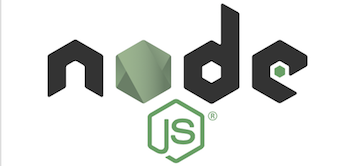

 Help
====

Need help with Node.js? You've come to the right place!

## [Create a new issue](https://github.com/nodejs/help/issues/new)

If you have a question about Node.js, [create a new issue](https://github.com/nodejs/help/issues/new)
and ask there!

[note] When inserting you're code:

<<<<<<< HEAD
[Please click here](https://github.com/nodejs/help/issues/new) to create a new issue if you have any questions.
=======
use 3 backticks, followed by `js`: As seen below  

>>>>>>> refs/remotes/nodejs/master

<blockquote>```js<br>
console.log('happy coding!')<br>
```</blockquote>

results in
```js
  console.log('happy coding!')
```


## Chat Resources

If you would prefer to get help via live chat rather than the issue tracker in
this repository, you can try:

* [Freenode #node.js channel](https://webchat.freenode.net/?channels=node.js&uio=d4)
* [Gitter Node.js room](https://gitter.im/nodejs/node)

## Participation
Want to help others with issues? You can start simply, by answering open questions.
